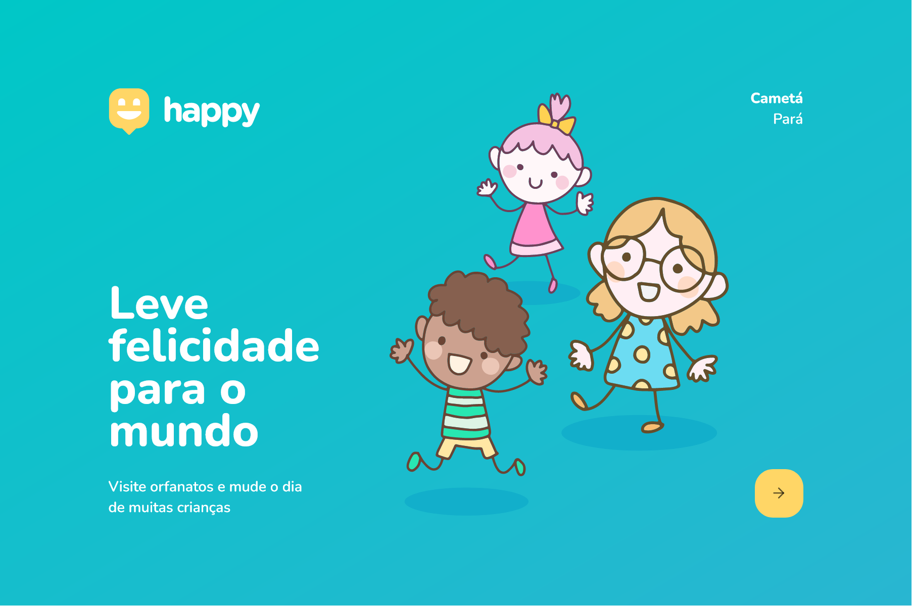
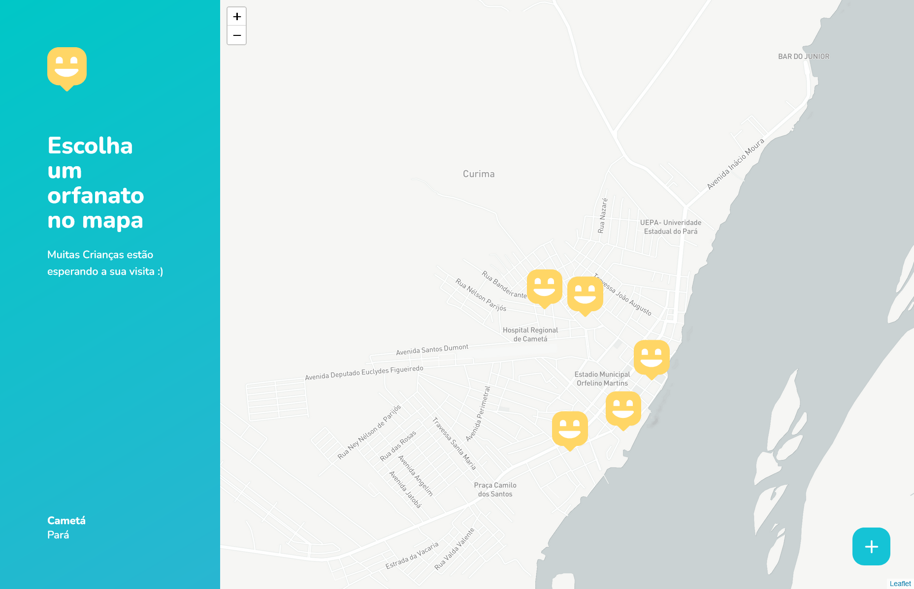
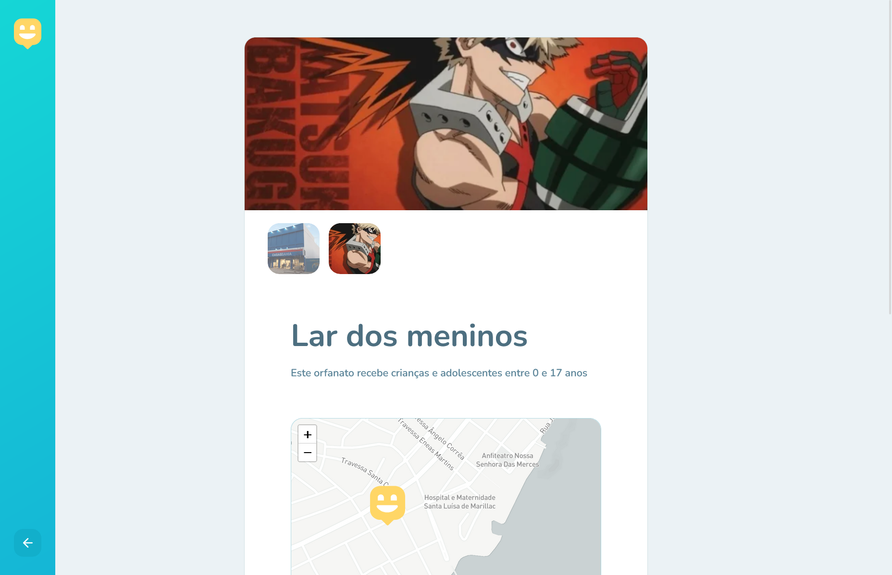
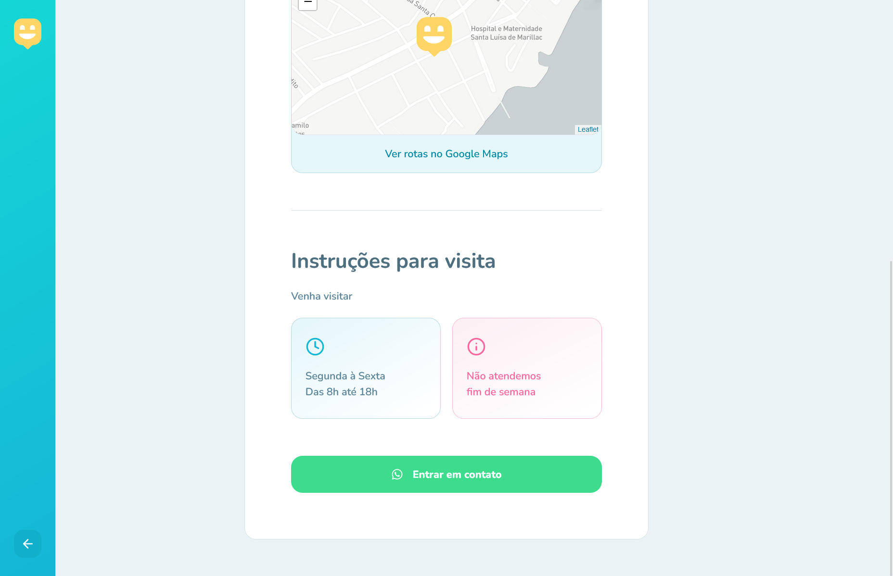
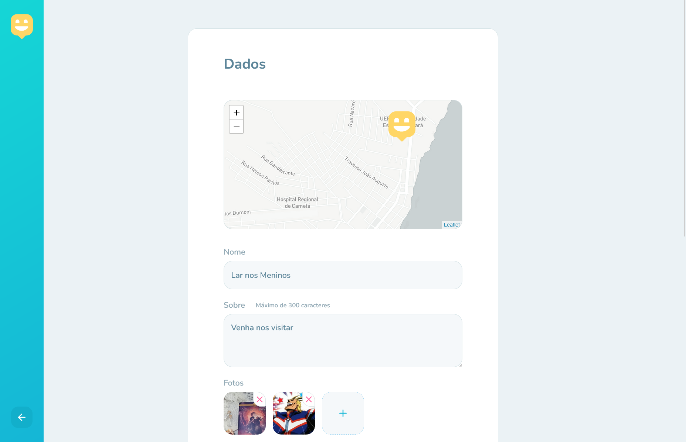
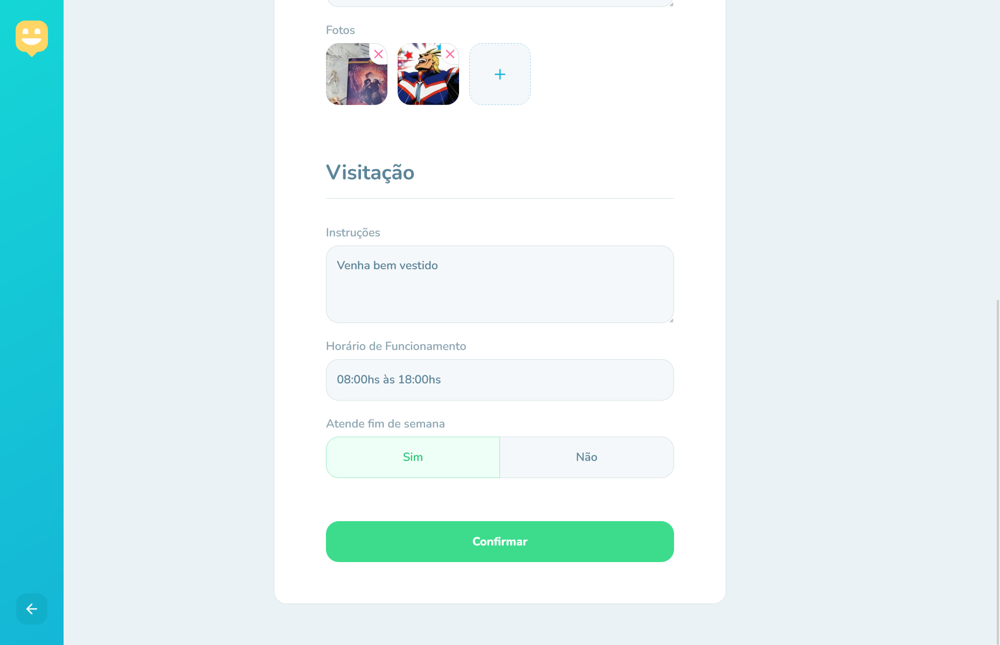
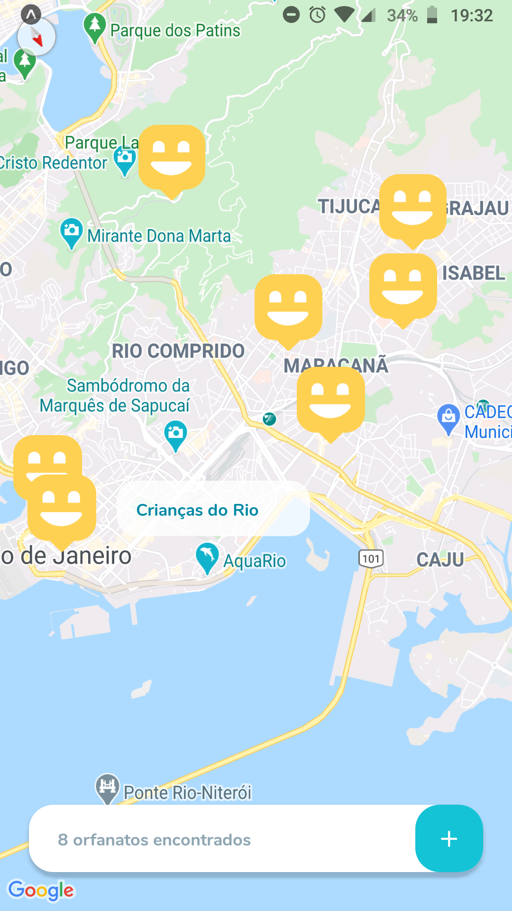
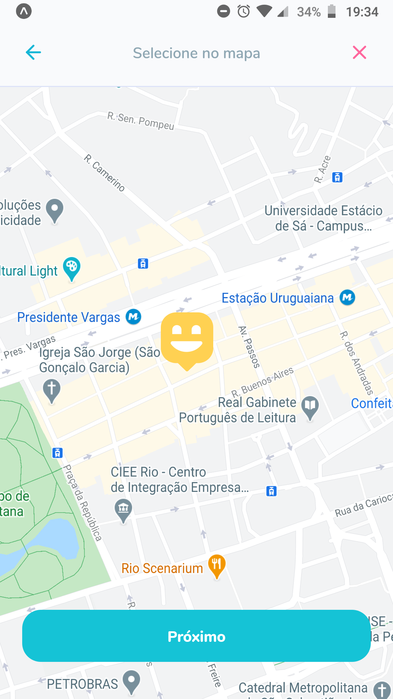
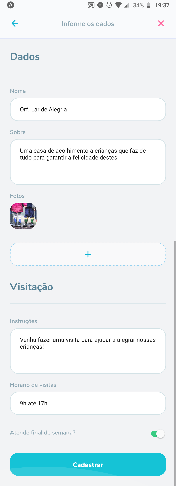
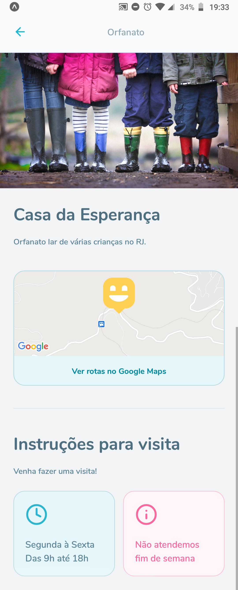

<h1 align="center" >
  
</h1>

Leve felicidade para o mundo, visite orfanatos e mude o dia de muitas crianças. NLW#3

<h4 align="center"> 
	Versão 1.0 🚀
</h4>

 <a href="#-sobre">Sobre</a> •
 <a href="#-layout">Layout</a> •
 <a href="#-rotas-do-backend">Rotas do Backend</a> • 
 <a href="#-executando-o-happy">Como executar</a> • 
 <a href="#tecnologias">Tecnologias</a> • 
 <a href="#como-contribuir">Como contribuir</a> • 
 <a href="#-licença">Licença</a>

---

## 💡 Sobre

Essa aplicação permite que, se você faz parte de um orfanato, cadastre ele no mapa e caso você queira visitar um orfanato e fazer o dia de muitas crianças mais feliz, este é o lugar que vai encontrar os orfanatos mais perto de você, na cidade do Rio de Janeiro.

Este projeto foi construído durante a terceira edição do evento Next Level Week da [Rocketseat](https://rocketseat.com.br/).

---

## 🎨 Layout

### Web

  

  
  
  
  
  
  
  
  
  

### Mobile

  
  
  
  

  
  
  

---

## 🗺 Mapbox

Siga as instruções para usar o mapbox no lugar do openstreetmap.

- Em "https://account.mapbox.com/", copie seu token.
- Na raiz do projeto web crie um arquivo chamado ".env"
- Dentro desse arquivo, digite "REACT_APP_MAPBOX_TOKEN =" e cole seu token logo depois.
- Entre no arquivo "OrphanagesMap.tsx", descomente o trecho de código correspondente as linhas 34, 35 e 36.
- No mesmo arquivo, comente a linha 32.

Se você fez tudo corretamente, estás usando a API do mapbox com seu Token na página do mapa. 😄

---

<h2 id="tecnologias"> 🛠️ Tecnologias </h2>

As ferramentas usadas no desenvolvimento do projeto.

#### Backend:
 - Typescript
 - NodeJS
 - Express
 - Express Async Errors
 - TypeORM
 - SQLite
 - Multer
 - Yup
 - Cors

#### Web:
- Typescript
- ReactJS ⚛️
- React Router Dom
- React Icons
- Leaflet 🍃
- API do Mapbox 🗺️
- Axios

#### Mobile:
- Typescript
- React Native
- React Native Maps
- React Navigation
- React Navigation Stack
- Expo
- Expo Fonts
- Expo Google Fonts - Nunito

---

<h2 id="como-contribuir"> ⚙️ Como contribuir </h2>

- Faça um fork desse repositório;
- Crie uma branch com a sua feature: `git checkout -b minha-feature`;
- Faça commit das suas alterações: `git commit -m 'feat: Minha nova feature'`;
- Faça push para a sua branch: `git push origin minha-feature`.

---

## 📝 Licença

Este projeto está sob licença [MIT](./LICENSE).

Feito com 💙 por Laciene Alves Melo

